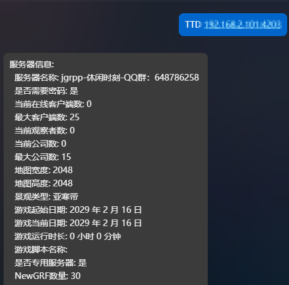

# astrbot_plugin_TTDservers
项目地址：https://github.com/Waitforbankruptcy/astrbot_plugin_TTDservers  
作者主页：https://github.com/Waitforbankruptcy  
AstrBot 插件，让你的bot拥有查询和播报openttd服务器的能力  
并且支持IPv4/IPv6/域名/公开邀请码
目前版本：v0.0.4（后续有时间可能会更新，也可能一直鸽）
v0.0.4更新如下：  
1.将原来的查询服务器信息里的grf列表改成的可选项  
2.为未来优化提供了前置条件（贪方便直接使用复制粘贴导致出现了部分臃肿）

使用命令：TTD ip:端口/公开邀请码 就可以查询OpenTTD服务器的一下信息：

"服务器名称"  
"服务器版本"  
"是否需要密码"  
"当前在线客户端数"  
"最大客户端数"  
"当前观察者数"  
"当前公司数"  
"最大公司数"  
"地图宽度"  
"地图高度"  
"景观类型"  
"游戏起始日期"  
"游戏当前日期"  
"游戏运行时长"  
"游戏脚本名称"   
"是否专用服务器"  
"NewGRF数量"  
"NewGRF列表"  

效果如下

联系方式：QQ：3442604696

